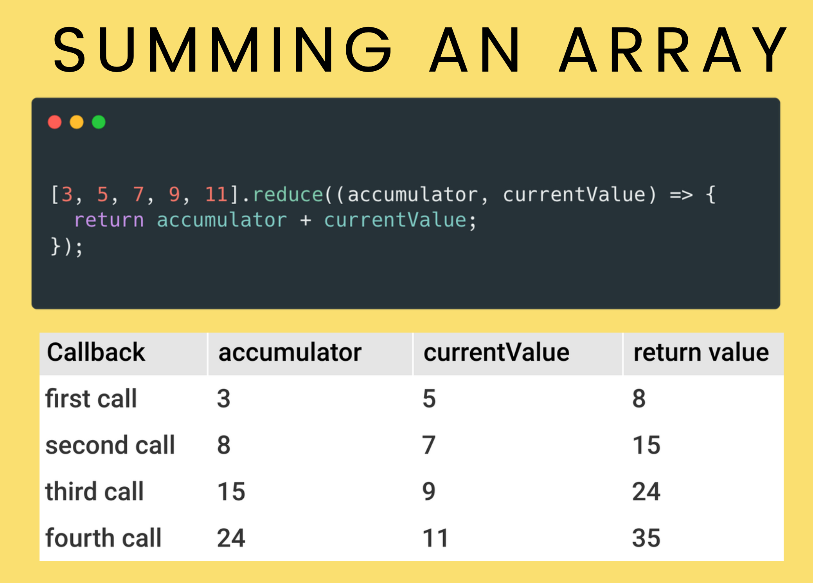

## 혼공 기록용(The Web Developer 부트캠프 2023 강의정리)

214. 함수 범위

	- 전역 변수
	- 지역 변수

215. 블록 범위

	- 블록은 함수를 제외하고 기본적으로는 중괄호{}가 있는 모든 곳을 가리킴
	(But, var 변수는 X, let&const만 변수의 범위가 블록으로 지정됨)
	
	- 왜 사용하는가?
	유효 범위 규칙을 따르는 변수들을 추가하기 위해

216. 렉시럴 범위
	- 부모 함수의 안에 중첩된 내부 함수는 해당 외부 함수의 범위에나 또는 범위 내에서 정의된 변수에 액세스 할 수 있다.

	- 또한 중첨된 함수나 내부 함수는 상위 몇 레벨 위에 있든 상관없이 부모 함수나 조부모 함수 등이 액세스하는 동일한 항목에 액세스 할 수 있다.

	- 위에서 아래로 실행되므로 역방향은 X
 
217. 함수 표현식
	const add = function (x, y){
	return x + y;
	}

	- =뒤에 오는 오른쪽 부분은 함수를 만들고 그 함수를 왼쪽 변수에 저장한다.
	(마치 객체, 배열, 숫자 등을 저장하듯이)

218. 고차 함수
	- 다른 함수와 함께 작동하거나 또는 다른 함수에서 작동하는 함수를 고급스럽게 표현한 것

	1. 다른 함수를 인수로 받아서 어떤 작업을 하는 함수accept other functions as arguments

	2. 함수를 반환할 수 있는 함수 return a function -> 반환 함수

219. 반환 함수
	- return 값에 function 함수를 넣어서 함수가 가지고 있는 값을 반환한다.

220. 메서드(Method) 정의

	- 메서드는 객체에 종속된 특성으로 함수에 포함되는 개념

	- 메스드 이름 앞에 점을 찍어 사용한다. 예를 들어 .indexOf() or .toUpperCase()

221. 'this'라는 불가사의한 키워드

	- 메서드에 있는 객체를 가리킬 때 this 키워드를 사용한다.

222. Try / Catch 사용하기

	- 오류 및 예외 처리(특히 오류를 잡아내서 코드 실행이 정지되거나 중단되지 않도록 하는 역할)

225. forEach 메서드 (콜백 메서드)

	- 배열 안의 아이템의 각각에 대해 함수와 코드를 한번씩 실행한다.

226. map 메서드 (콜백 배열 메서드)

	- 콜백 함수를 수령해서 배열의 요소당 1번씩 실행한다. == forEach와 비슷함

	- forEach와의 차이점은 그 콜백의 반환 값을 이용해서 새로운 배열을 생성한다. 

227. arrow 화살표 함수

	- "함수 표현식"을 만들 때 자주 사용된다.

	- 매개변수를 하나만 받을 경우 소괄호()를 생략 가능. but, 2개 이상의 매개변수를 받는다면 무조건!!! 소괄호()를 넣어야 한다.

	- 예) const plus = num => {return num + num;}
		const onePlus = (x, z) => {return x * z; }

228. 화살표 함수의 반환

	- 특정 상황에서 return(반환) 키워드를 생략 가능, 즉 코드를 짧게 만드는데 유용함(한 줄의 코드나 짧은 함수의 경우에만 암시적 반환과 화살표 함수를 사용하는 것이 유용하다!)
	대신, 중괄호 대신 소괄호로 바꿔줘야 한다.

	- 예) const rollDie = () => (
			Math.floor(Math.random() * 6) +1
		)

230. setTimeout() & setInterval()

	- 배열과 관계없는 메서드

	- 함수의 실행을 연기, 대기, 중단하거나 추후 날짜로 실행을 연기하거나 또는 기본적으로 작업 일정을 정한다. 

	1. setTimeout()
		- 첫 번째 인수는 원하는 동작(handler)을, 두 번째 인수는 밀리 초(ms)를 가르키는 숫자 넣기(실행을 얼마나 지연 시킬지)

		ex) setTimeout(() => {console.log('hi')}, 3000 )

	2. setInterval()
		- 전달할 함수를 호출한다. 콜백을 매 특정 밀리 초 마다 호출하는 함수이다. 
		- 즉, 인터벌을 두고 작업을 반복한다. 
		- 구조는 setTimeout()과 똑같다.
		- 이 함수를 쓰려면 setInterval의 반환값을 저장하기만 하면  된다. 호출할 때마다 이 함수가 설정해 놓은 인터벌에 해당하는 ID를 반환한다.
		- 따라서 서로 다른 인터벌로 실행되는 다양한 setInterval함수를 5, 6개든 잔뜩 호출할 수 있고, 이 ID를 사용해서 중단하고 싶은 함수를 지정할 수 있다.
		- clearInterval을 호출하고 해당 ID를 전달함 clearInterval(id) => 중단됨

		- setInterval을 사용할 땐 clearInterval을 같이 사용하여 페이지가 열린 동안 작업이 끝없이 반복되는걸 방지해야 한다. 

231. Filter 메서드

	- 요소로 구성된 배열에서 필터링을 하거나 부분 집합을 모아 새로운 배열을 만드는데 쓰임

	- 원본 배열을 바꾸지 않음!!!

	- filter는 평점이 높은 아이템이나, 오래된 아이템(오래된 순), 새로운 아이템(최신순) 등을 필터링하려고 할 때, 굉장히 유용함

232. every와 Some 메서드

	- 불리언 메서드 (참과 거짓을 반환함)

	- 즉, 테스트를 하는 방법

	1. every
		- 배열 내의 모든 요소가 every를 통해 테스트를 거치는데 일단 함수를 전달한다. 
		- 모든 요소가 해당 함수로 전달되어 참을 반환하면 호출된 전체 every 함수가 참을 반환함

	2. Some
		- every와 굉장히 비슷하지만 한가지 다른점은 요소 중 하나 또는 일부가 테스트를 통과하는지 여부를 테스트 한다.
		- every처럼 모든 각각의 요소가 해당 콜백에서 참을 반환하는지는 상관하지 않고, some에서는 하나 이상인지 여부만 본다.
		- 이 콜백을 가져가서, 배열에서 각각의 요소를 전달했을 때 최소 한번 이상 참이 반환되는지 여부를 확인하는 것!

233. Reduce 메서드

	- 배열을 가지고 점차 줄여가면서 💡결국 하나의 값만 남긴다.

	- Reduce는 자동적으로 배열 안에 있는 모든 요소를 처리하거나 하지 않음

	- 예를 들어
	[3, 5, 7, 9, 11].reduce((accumulator, currentValue) => {
		return accumulator + currentValue;
	});
	첫번째 매개변수 accumulator는 💡총 합계를 나타냄(기본적으로, 줄여나가야 하는 대상임)
	두번째 매개변수인, 각각의 숫자인 currentValue는 마음대로 부를 수 있음(💡각각의 개별 요소 나타냄)
	- 저 식을 해석하자면 
	반환된 값을 바로 그 다음 번 순회의 accumulator에 사용됨
	- 
	

	- const evens = [2,4,6,8];
	evens.reduce((sum, num) => sum + num)이면 20이 출력됨

	- ⭐️ 그런데 reduce에 두번째 인수를 전달 할 수 있다.
	reduce 함수에 대한 별도의 두번째 인수를 전달한다.
	evens.reduce((sum, num) => sum + num 첫번째 인수, 100 두번째 인수는 sum에 대한 초기값으로 사용됨) 
	즉 100으로 시작해서 모든 숫자를 여기에 더한다.
	그렇다면 120이 출력됨
	evens.reduce((sum, num) => sum + num, 40)이면 60

	- ⭐️ 이렇게 두번째 인수를 따로 지정할 수 있고 그 인수가 reduce함수의 초기값이 된다!!!!

234. 화살표 함수와 'this'

	- 'this'키워드는 함수가 만든 범위와 아무 관련 없고 함수를 실행하는 방법과 관련있다.

	- 하지만 화살표 함수는 그렇지 않다!!!

	- ⭐️ 일반 함수와 달리 화살표 함수에서 this 키워드는 다르게 동작한다.
